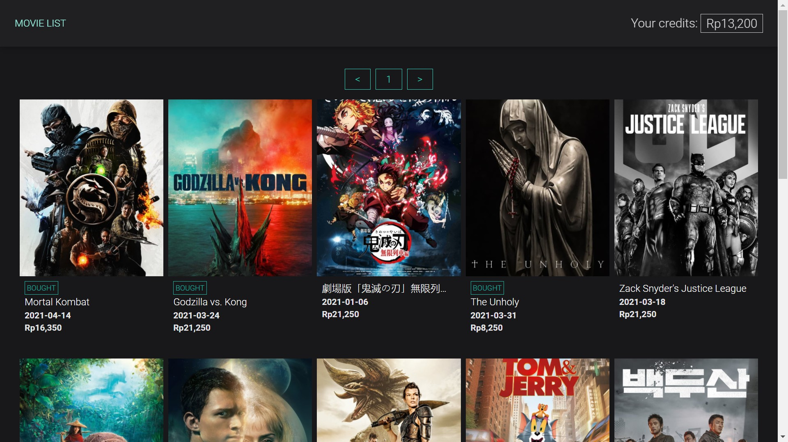
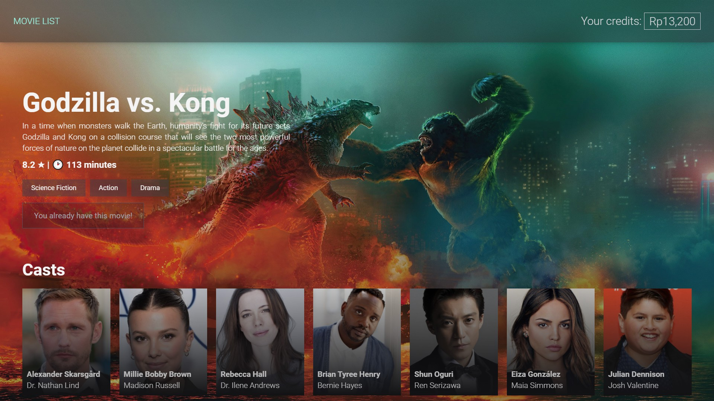

# streamflix-rice
A simple Single Page App built with Vue
The following 

## Project setup
```bash
# Copies env file
cp .env.example .env 
npm install
```

### Compiles and hot-reloads for development
```
npm run serve
```

### Lints and fixes files
```
npm run lint
```
### Deployment
The following project has been deployed at https://streamflixrice.z13.web.core.windows.net/

### Screenshots



### Credits
The Movie Database API (link [here](https://developers.themoviedb.org/3/getting-started/introduction))

### Author
William Fu
